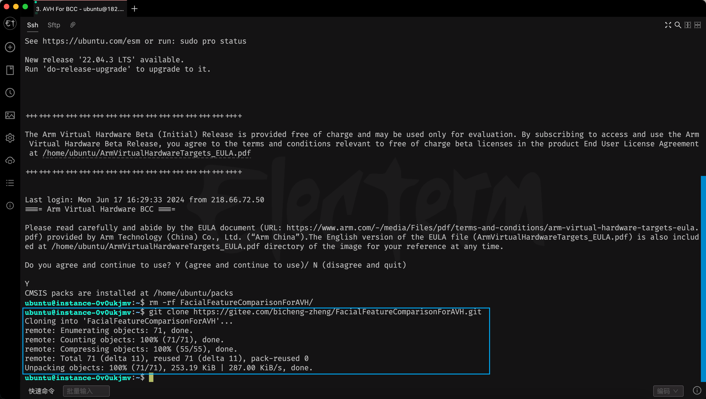
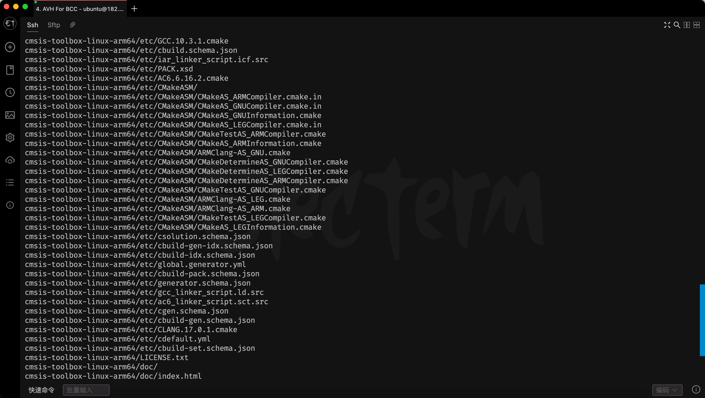
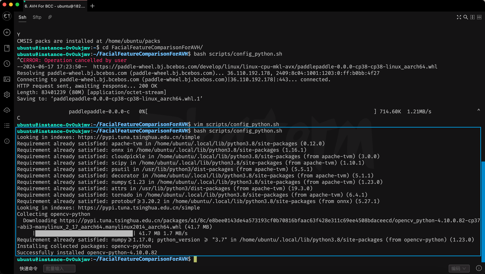
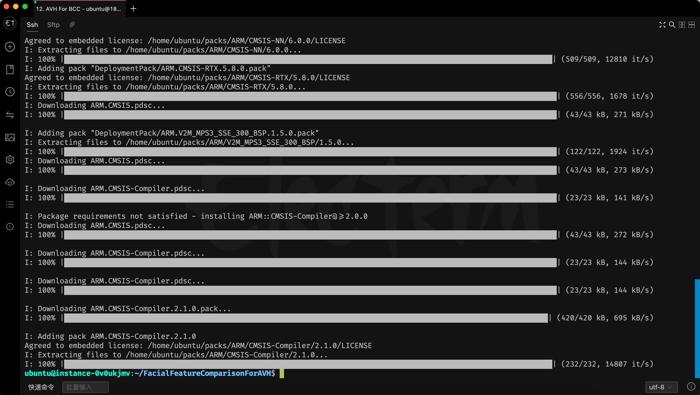
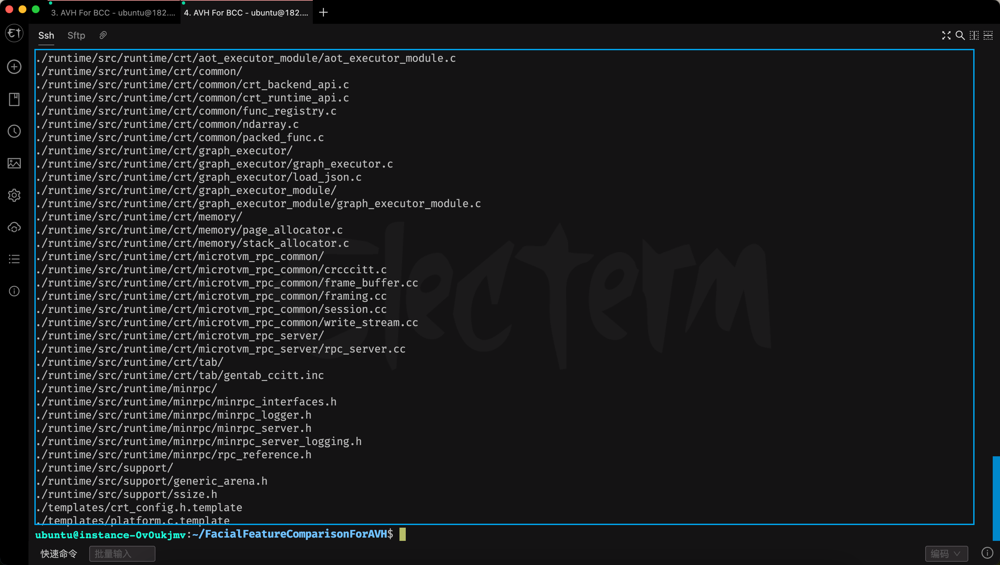
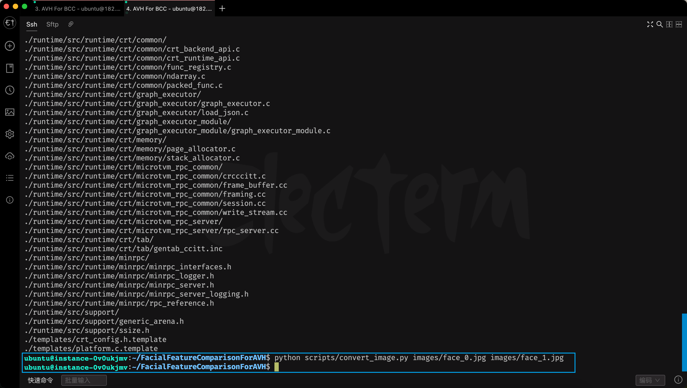
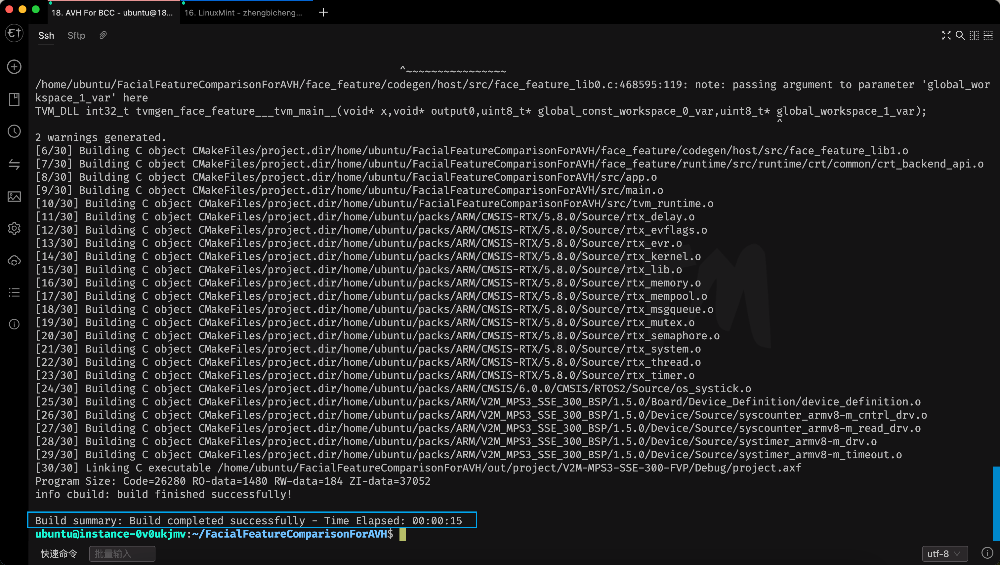

<center><b>基于AVH实现人脸特诊提取模型的部署</b></center>

# 1 实验背景

## 1.1 Arm 虚拟硬件介绍

在现代嵌入式和物联网开发中，快速迭代和高效测试至关重要。Arm 虚拟硬件（Arm Virtual Hardware, AVH）提供了一个强大的开发环境。基于 Arm 虚拟硬件的百度云服务器内置 Ubuntu Linux 镜像，并包含了丰富的 Arm 开发工具，如 Arm 编译器、FVP 模型和针对 Cortex-M 系列处理器的其他工具。这些工具不仅帮助开发者快速上手，还支持评估 CI/CD、MLOps 和 DevOps 工作流中的自动化测试。订阅访问和使用此版本的 Arm 虚拟硬件，您需同意产品最终用户许可协议中与免费测试版许可相关的条款和协议。 
 
Arm 虚拟硬件产品的技术概览示意图如下所示。开发者也可访问 Arm 虚拟硬件[产品介绍页](https://www.arm.com/products/development-tools/simulation/virtual-hardware)和产品[技术文档](https://arm-software.github.io/AVH/main/overview/html/index.html)了解更多关于 Arm 虚拟硬件产品知识。 

<br>
<div align=center>

<br>图1. Arm 虚拟硬件产品概览</div>
<br>

## 1.2 文章简介

本文将详细介绍如何基于 AVH 部署一个人脸特征提取模型。通过利用 AVH，我们可以在不依赖实际硬件的情况下进行高效开发和测试，从而大大缩短开发周期。本文将涵盖以下内容：

- 配置 AVH 开发环境
- 配置并编译人脸特征提取模型
- 编译基于 AVH 实现的人脸特征提取 Demo
- 在 AVH 上进行部署和测试

# 2 实验目标

1. 了解 Arm 虚拟硬件产品的功能及核心优势。
2. 熟悉 Arm 虚拟硬件云服务器 BCC 实例的订阅流程及 Arm 虚拟硬件镜像内的主要组件。
3. 掌握如何使用 Arm 虚拟硬件云服务器 BCC 实例进行嵌入式软件的开发（例如：机器学习、物联网应用等）并熟悉其基本的开发流程，包括：如何搭建开发环境、编译构建应用代码、运行调试工程代码等步骤。


# 3 实验前准备

## 3.1 订阅 Arm 虚拟硬件镜像的百度智能云云服务器 BCC 实例

在实验开始前请参考 [如何订阅使用 Arm 虚拟硬件镜像的百度智能云云服务器 BCC 实例](https://github.com/Zheng-Bicheng/FacialFeatureComparisonForAVH/blob/main/docs/subscription.md) 来购买并初始化一个基于 Arm 虚拟硬件镜像的百度智能云云服务器 BCC 实例。

## 3.2 克隆实验代码

首先我们需要将实验代码克隆（下载）至 BCC 服务器实例中，便于后续使用 Arm 虚拟硬件镜像环境中的软件开发工具进行进一步的开发调试。
本实验代码的仓库地址为：https://github.com/Zheng-Bicheng/FacialFeatureComparisonForAVH.git ，通过以下命令可以将代码仓库中的代码克隆下载至服务器中。

```bash
git clone https://github.com/Zheng-Bicheng/FacialFeatureComparisonForAVH.git
```

为了加速大家的下载速度，我们也提供了gitee镜像源，通过以下命令可以使用gitee镜像源将代码仓库中的代码克隆下载至服务器中。

```bash
git clone https://gitee.com/bicheng-zheng/FacialFeatureComparisonForAVH.git
```

命令执行后参考结果示意图如下所示：

<div align=center>

<br>图3-2-1. 克隆实验代码结果演示</div>
<br>

# 4 实验步骤

## 4.1 配置开发环境

该项目基于 **使用Arm 架构的百度云服务器** 并利用 **Arm 虚拟硬件 (Arm Virtual Hardware, AVH)** 运行。根据服务器架构的不同，我们需要针对性的对开发环境进行配置。为了简化大家的时间，我们提供了两个脚本文件来帮助大家快速配置环境，如需了解更多细节，请参考脚本文件中的注释:

- [FacialFeatureComparisonForAVH/scripts/config_cmsis_toolbox.sh](https://github.com/Zheng-Bicheng/FacialFeatureComparisonForAVH/blob/main/scripts/config_cmsis_toolbox.sh)
- [FacialFeatureComparisonForAVH/scripts/config_python.sh](https://github.com/Zheng-Bicheng/FacialFeatureComparisonForAVH/blob/main/scripts/config_python.sh)
- [FacialFeatureComparisonForAVH/scripts/config_pack.sh](https://github.com/Zheng-Bicheng/FacialFeatureComparisonForAVH/blob/main/scripts/config_pack.sh)

### 4.1.1 配置 CMSIS-ToolBox 环境

[CMSIS-Toolbox](https://arm-software.github.io/CMSIS_6/latest/Toolbox/index.html) 是作为 Open-CMSIS-Pack 项目的一部分开发的，该项目与 Arm、NXP 和 STMicroelectronics 合作。它是下一代软件工具的重要组成部分，并统一了与流行的嵌入式工具链（Arm、GCC、IAR 和 LLVM 编译器）的开发流程，CMSIS-Toolbox 提供了命令行工具，用于：

- 利用软件包创建项目并构建嵌入式应用程序，支持使用多种编译工具。
- 利用 CMSIS-Pack 格式创建、维护和分发软件包。

你可以执行以下代码来快速配置 CMSIS-ToolBox 的开发环境：

```bash
cd /path/to/FacialFeatureComparisonForAVH  # 进入项目根目录
sudo bash scripts/config_cmsis_toolbox.sh
```

命令执行后参考结果示意图如下所示：

<div align=center>

<br>图4-1-1. 配置 CMSIS-ToolBox 开发环境结果演示</div>
<br>

### 4.1.2 配置 Python 环境

Python语法和动态类型，以及解释型语言的本质，使它成为多数平台上写脚本和快速开发应用的编程语言，你可以执行以下代码来快速配置 Python 的开发环境：

```bash
cd /path/to/FacialFeatureComparisonForAVH  # 进入项目根目录
source scripts/config_python.sh
```

<div align=center>

<br>图4-1-2. 配置 Python 开发环境结果演示</div>
<br>

### 4.1.3 配置 CMSIS-Pack 软件包

本实验项目的开发采用了 [Open-CMSIS-Pack](https://www.open-cmsis-pack.org/) 项目的标准形式，我们可以使用 Arm 虚拟硬件镜像中预装的 [CMSIS-Toolbox](https://github.com/Open-CMSIS-Pack/cmsis-toolbox) 工具包里的 **cbuild** 工具来构建本实验项目。
**需要注意的是**，正常情况下，运行 `cbuild` 命令在构建工程的过程中会自动下载项目所依赖的 [CMSIS Packs](https://www.keil.arm.com/packs/) 软件包。但由于国内外网络环境的差异，部分 CMSIS Packs 软件包资源的下载速度较慢导致无法自动下载成功。因此，为便于开发者顺利地完成本实验项目的体验，我们提供了脚本文件一键下载和安装 Packs ，你可以执行以下代码来快速配置开发环境：

```bash
cd /path/to/FacialFeatureComparisonForAVH  # 进入项目根目录
bash scripts/config_pack.sh
```

<div align=center>

<br>图4-1-3. 配置 CMSIS-Pack 软件包结果演示</div>
<br>

## 4.2 配置并编译人脸特征提取模型

### 4.2.1 模型介绍

本项目使用的人脸识别特征提取模型是 **Adaface** ，你可以在 [insightface/recognition/arcface_paddle](https://github.com/deepinsight/insightface/tree/master/recognition/arcface_paddle) 中找到它的详细介绍。受限于 MCU 设备极为紧张的内存，我们这里选用了 backbone 为 **MobileFace** 的 **Adaface** 模型，以下是它的详细参数：

| Model structure           | lfw    | cfp_fp  | agedb30 | CPU time cost | GPU time cost | Inference model |
| ------------------------- | ------ | ------- | ------- | -------| -------- |---- |
| MobileFace-Paddle      | 0.9952 | 0.9280  | 0.9612  | 4.3ms  | 2.3ms    | [download link](https://paddle-model-ecology.bj.bcebos.com/model/insight-face/mobileface_v1.0_infer.tar)  |

### 4.2.2 使用 TVM 编译模型

本项目参考了 [ArmDeveloperEcosystem/Paddle-examples-for-AVH](https://github.com/ArmDeveloperEcosystem/Paddle-examples-for-AVH)，使用 **TVM** 来将人脸特征提取模型转换成可以在 MCU 设备上部署的 C 代码，关于 TVM 的更多介绍，你可以参考 [apache/tvm](https://github.com/apache/tvm)。

在使用 TVM 转换 PaddlePaddle 模型的过程中，我们较为建议的流程为:

1. 获取 **PaddlePaddle** 静态图模型
2. 使用 **Paddle2ONNX** 将 **PaddlePaddle** 模型转换 **ONNX** 模型
3. 使用 **TVM** 将 **ONNX** 模型转换为为可以在 MCU 设备上部署的 C 代码

为了简化大家的时间，我们提供了脚本文件来帮助大家快速利用 TVM ，如需了解更多细节，请参考脚本文件中的注释:

- [FacialFeatureComparisonForAVH/scripts/build_facial_feature_model.sh](https://github.com/Zheng-Bicheng/FacialFeatureComparisonForAVH/blob/main/scripts/build_facial_feature_model.sh)

你可以执行以下代码来快速使用 TVM 编译模型（受限于服务器性能，编译可能需要持续较长的时间，请耐心等待）

```bash
cd /path/to/FacialFeatureComparisonForAVH  # 进入项目根目录
bash scripts/build_facial_feature_model.sh
```

<div align=center>

<br>图4-2-2-1. 使用 TVM 编译模型结果演示</div>
<br>

运行脚本后，该项目目录下将出现 **face_feature** 文件夹，文件夹内存放了可以在 MCU 设备上部署模型的 C 代码。

## 4.3 编译基于 AVH 实现的人脸特征提取 Demo

### 4.3.1 将图片转换为输入数据

[FacialFeatureComparisonForAVH/images](https://github.com/Zheng-Bicheng/FacialFeatureComparisonForAVH/tree/develop/images) 目录下存放了三张人脸图片，其中 **face_0.jpg** 和 **face_1.jpg** 为人脸 A ，**face_2.jpg** 为人脸 B 。通常情况下，将图片转换为模型的输入需要经过以下三个步骤:

1. 颜色通道转换（BGR2RGB）
2. 图片缩放（Resize）
3. 图片归一化（Normalize）

为了简化大家的时间，我们同样提供了 python 脚本来帮大家快速将输入图片转换为输入数据，如果你想要了解更多的细节，请参考脚本文件中的注释:

- [FacialFeatureComparisonForAVH/scripts/convert_image.py](https://github.com/Zheng-Bicheng/FacialFeatureComparisonForAVH/blob/main/scripts/convert_image.py)

你可以执行以下代码来快速将输入图片转换为输入数据

```bash
cd /path/to/FacialFeatureComparisonForAVH  # 进入项目根目录
python scripts/convert_image.py images/face_0.jpg images/face_1.jpg
```

<div align=center>

<br>图4-3-1. 将图片转换为输入数据结果演示</div>
<br>

### 4.3.2 编译该项目

本项目以 [csolution](https://github.com/Open-CMSIS-Pack/cmsis-toolbox/blob/main/docs/YML-Input-Format.md) 格式提供，我们使用 [CMSIS-Toolbox](https://github.com/Open-CMSIS-Pack/cmsis-toolbox/blob/main/docs/build-operation.md) 中的 cbuild 工具在命令行中构建项目。你可以执行以下代码来快速编译本项目。

```bash
cbuild project.csolution.yml
```

<div align=center>

<br>图4-3-2. 编译该项目结果演示</div>
<br>

# 5 在 AVH 上进行部署和测试

```bash
/opt/VHT/bin/FVP_Corstone_SSE-300 --stat --simlimit 8000 -f FVP_Corstone_SSE-300_Config.txt out/project/V2M-MPS3-SSE-300-FVP/Debug/project.axf
```


其中，该命令部分参数解读如下：

-  `/opt/VHT/bin/FVP_Corstone_SSE-300` 即为所调用的 Cortex-M55 的 FVP 模型的名称。
-  `--stat` 表示停止模拟时，打印相关的运行状态信息。
-  `--simlimit 8000` 表示模拟运行的时间上限为 8000s，即若用户未手动退出，则8000s 后程序会自动退出运行。
-  `out/image.axf` 即为所执行的应用文件，即本实验项目开发的指纹图像识别应用的可执行文件。
-  `-f FVP_Corstone_SSE-300_Config.txt` 即指定了 FVP 模型运行时的所依据的配置文件。可以通过 `/opt/VHT/bin/FVP_Corstone_SSE-300 -l` 命令获取基于 FVP_Corstone_SSE-300 的所有可配置的参数及其默认值（初始值）信息。用户可根据自身需求进行参数调整，获得不同的应用执行效果。

# 6 参考资料

1. [Arm 虚拟硬件产品简介](https://www.arm.com/virtual-hardware)
2. [Arm 虚拟硬件帮助文档](https://arm-software.github.io/AVH/main/overview/html/index.html)
3. [Arm 虚拟硬件开发者资源](https://github.com/ARM-software/VHT)
4. 【中文技术指南】[Arm 虚拟硬件实践专题一：产品订阅指南（百度智能云版）](https://mp.weixin.qq.com/s/sYQkM9EaBveB2KHJKopkbQ)
5. 【中文技术指南】[Arm 虚拟硬件实践专题二：Arm 虚拟硬件 FVP 模型入门指南](https://mp.weixin.qq.com/s/E-R7Jmlsu_jENg6AYA9tjw)
6. 【中文视频直播课】[加速AI开发，1小时快速入门Arm虚拟硬件](https://live.csdn.net/room/csdnnews/5m2CBlDp)
7. [Arm® Keil® Microcontroller Development Kit (MDK) Getting Started Guide](https://developer.arm.com/documentation/109350/v6)
8. [Open-CMSIS-Pack](https://www.open-cmsis-pack.org/)
15. [CMSIS-Toolbox](https://arm-software.github.io/CMSIS_6/latest/Toolbox/index.html)
13. [Github/apache/tvm](https://github.com/apache/tvm)
14. [Github/deepinsight/insightface](https://github.com/deepinsight/insightface)
20. Arm 社区微信公众号
   <div align=center>
    
   </div>
   <br>